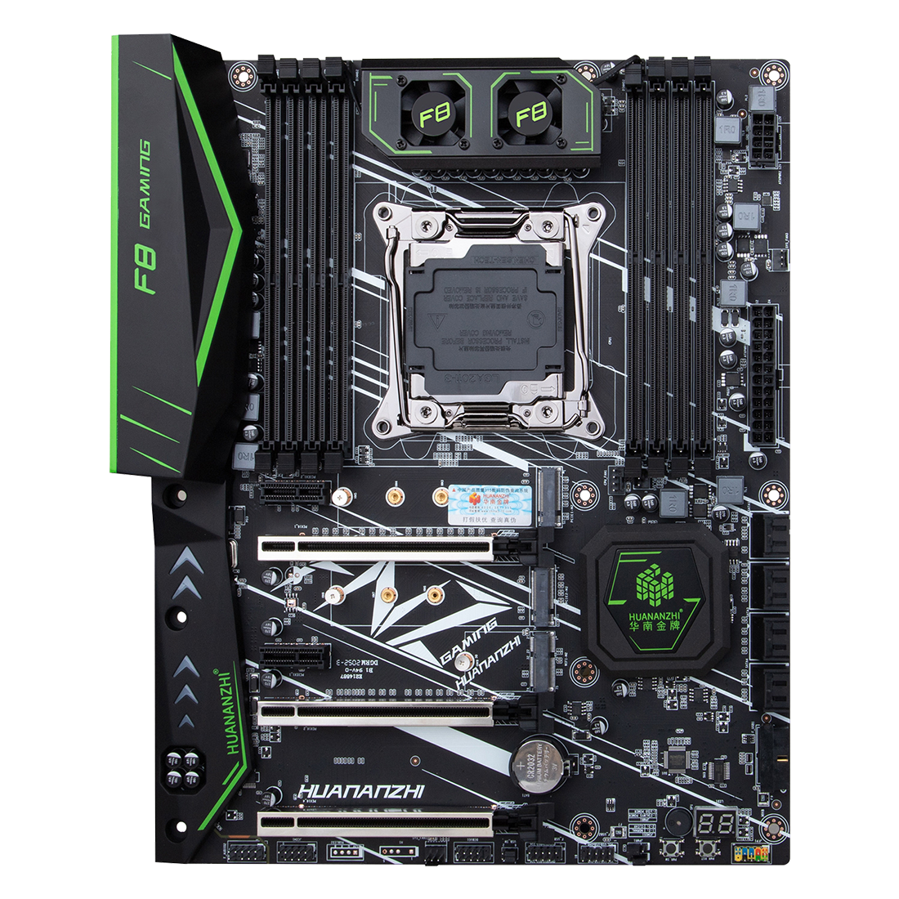

# OpenCore-x99

#### 介绍
OpenCore华南金牌x99黑苹果

#### 硬件：
|             |                                                       |
| :---------: | :---------------------------------------------------: |
| 主板         | 华南X99-F8主板 intelC612芯片组                                     |
| CPU         | E5 2695 V4                                  |
| 显卡         | RX580 8g(2304sp)                   |
| 内存         | 三星单条32g 2133 REGECC x 8                        | 

##### 主板图片：


#### 软件架构说明:
- 使用`OpenCore`简称`OC`来引导主板进行macOS系统安装


#### 安装教程
##### A)主板bios设置
- 1、`IntelRCSetup-->Processor Configuration-->MSR Lock control 配置 Disable`
- 2、`Setup-->Advanced-->NCT5532D Super IO Configuration-->Serial Port 配置 Disable`
- 3、`Setup-->CSM Configuration-->CSM Support 配置 Disable`如何配置请自行查阅相关教程
- 4、 `Above 4G Decoding`可以开启也可以不开启

##### B)制作安装U盘
- 1. 
- 2. 
- 3. 

#### 关于CPU E5-26xx V3 V4变频数据

##### V3: 
`Kernel -> Emulate`
- Cpuid1Data: `C3060300 00000000 00000000 00000000`
- Cpuid1Mask: `FFFFFFFF 00000000 00000000 00000000`
##### V4:
`Kernel -> Emulate`
- Cpuid1Data: `D4060300 00000000 00000000 00000000`
- Cpuid1Mask: `FFFFFFFF 00000000 00000000 00000000`
#### 关于单盘双系统
- 推荐采用配置文件上的示范，在`EFI`目录中新建一个名为`win`的文件夹来存放`win引导`避免引导覆盖,示范目录结构如下：
```
EFI|
---|BOOT
---|OC
---|win
---|----|Microsoft
```
#### 关于自定义内存分布序号
|  |  |  |  |  |
|:---:|:---:|

#### 参与贡献

1.  Fork 本仓库
2.  新建 Feat_xxx 分支
3.  提交代码
4.  新建 Pull Request


#### 特技

1.  使用 Readme\_XXX.md 来支持不同的语言，例如 Readme\_en.md, Readme\_zh.md

